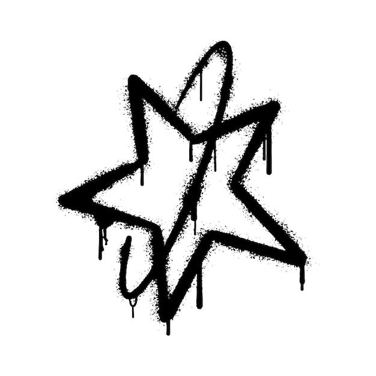

<p align="center">
  
</p>

<h1 align="center">luteab-assets</h1>

<p align="center">Images for the Luteab Macro, hosted here so the macro never relies on someone else's links staying online.</p>

> [!NOTE]
> Luteab isn't finished or released yet. This repo is just the image assets it loads. Things may move around until the first release.

## What's in here

- `biome_thumbnails/` has one image per biome (`GLITCHED.png`, `CYBERSPACE.png`, `SAND STORM.png`, and so on), plus a `biome_placeholder.png`.
- `merchants/` has the merchant icons: jester, rin, mari, and eden.
- `branding/` holds the default webhook icon.
- `credits/` has contributor avatars.

## Using an image

Every file has a direct link you can paste into Discord or the macro's Servers tab:

```
https://raw.githubusercontent.com/lumielll/luteab-assets/main/<path>
```

For example, the GLITCHED thumbnail:

```
https://raw.githubusercontent.com/lumielll/luteab-assets/main/biome_thumbnails/GLITCHED.png
```

## Credits

The biome thumbnails came from maxstellar's `biome_thumb`, `xVapure/Noteab-Macro`, and `vexthecoder/OysterDetector`. DREAMSPACE uses Luteab's own image.
